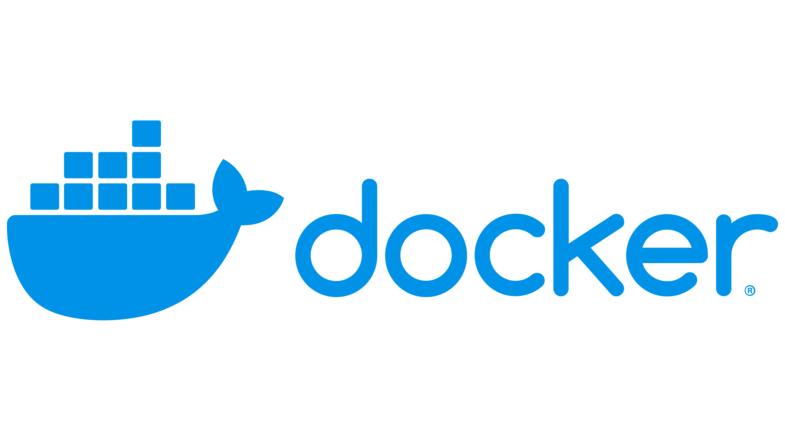

# fullcycle-study
Advanced study on modern software development architecture

# Explorando o Docker

- O que são containers?
    - Containers são uma forma de empacotar aplicações com todas as suas dependências, de forma que possam ser executadas de forma isolada em qualquer ambiente.
- O que é Docker?
    - Docker é uma plataforma de código aberto que facilita a criação, execução e gerenciamento de containers.
- Que linguagem de programação foi utilizada para desenvolver o Docker?
    - Go -> https://golang.org/
- O que é Docker Hub?
    - Docker Hub é um serviço de registro de imagens Docker, onde é possível encontrar imagens prontas para serem utilizadas.
- O que é Docker Compose?
    - Docker Compose é uma ferramenta que permite a definição e execução de aplicações multi-container Docker.

# Conteiners

- Namespace
    - Namespace é um recurso do kernel do Linux que permite isolar processos, redes, sistemas de arquivos, entre outros recursos do sistema operacional.
        - PID: Isola processos
            - `ps aux`
        - NET: Isola interfaces de rede
            - `ip a`
        - IPC: Isola mecanismos de comunicação entre processos
        - MNT: Isola sistemas de arquivos
        - UTS: Isola identificadores de host e domínio
        - USER: Isola usuários
- Cgroups (Criado pelo Google)
    - Cgroup: Isola recursos de hardware dos containers
        - CPU
            - `cat /proc/cpuinfo`
        - Memória
            - `cat /proc/meminfo`
        - Disco
        - Rede
- Resumindo, containers são processos isolados que compartilham o kernel do sistema operacional.

- 3 Pilares de Containers
    - Namespace
        - Isola processos, redes, sistemas de arquivos, entre outros recursos do sistema operacional.
            - Ex: PID, NET, IPC, MNT, UTS, USER.
    - Cgroups
        - Isola recursos de hardware dos containers.
            - Ex: CPU, Memória, Disco, Rede.
    - OverlayFS
        - OverlayFS é um sistema de arquivos que permite a criação de camadas de arquivos, facilitando a criação de imagens Docker.
            - Ex: Camadas(Layer) de imagens Docker.

# Referências
- https://www.docker.com
- https://docs.docker.com
- https://hub.docker.com